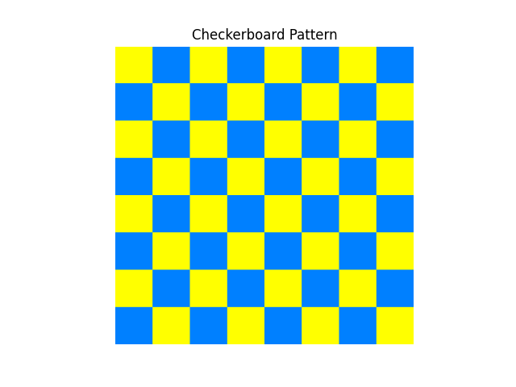
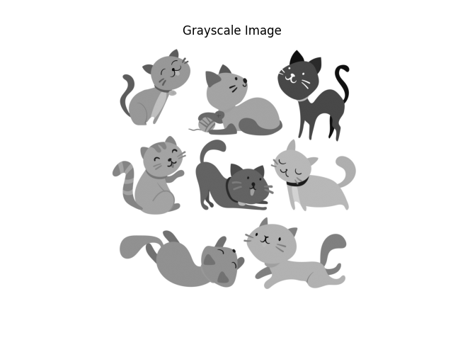
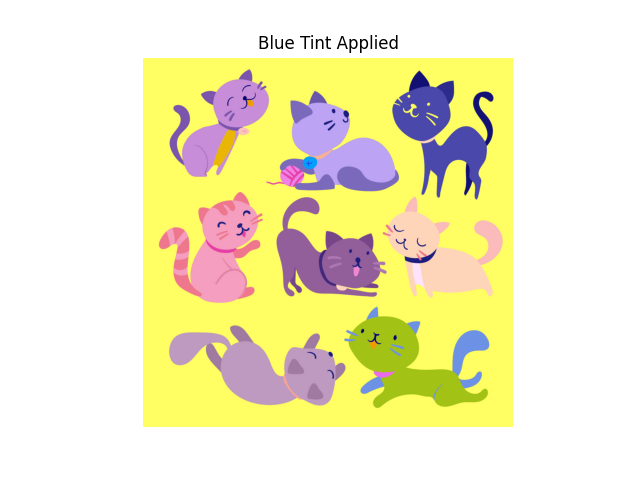
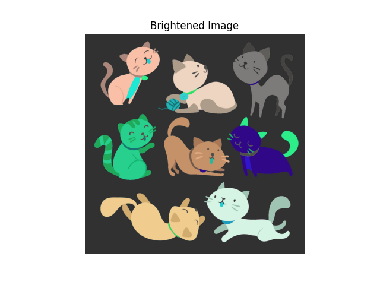
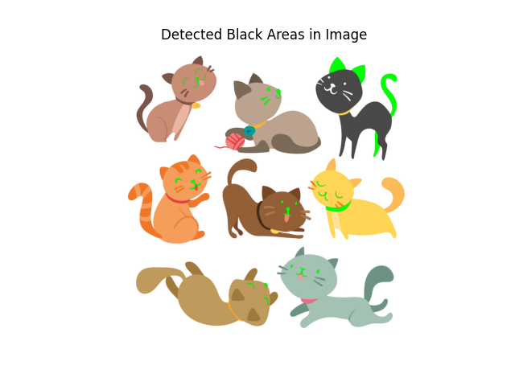

NAME:NUR LAYNIE EMELLY BINTI MUHAMMAD AMIRUL HAW

GROUP: M3CDCS2554B

SUBJECT: ITT440

# NUMPY FOR COMPUTER, VISUAL & GRAPHIC (CVG) PROCESSING
This project explores how NumPy is used in CVG: Computer, Visual, and Graphic processing, including the generation of pixel graphics and the manipulation of image data.

## What is CVG (Computer, Visual & Graphic) Processing?

Computer, Visual & Graphic (CVG) processing is about using computers to generate, transform, and analyze digital visuals.  
It includes both:
- Graphics generation (creating pixel patterns, visual designs using code)
- Image manipulation (editing colors, brightness, detecting areas)

It forms the foundation behind computer vision, game design, photo editing, and visual data analysis.

## Why Use NumPy for CVG Tasks?
NumPy is a lightweight Python library that allows developers to manipulate arrays of pixels directly.  
Using NumPy, we can:
- Generate visual graphics without traditional drawing
- Apply filters and enhancements to images
- Detect specific patterns or colors

All using efficient, simple code — ideal for learning the basics of CVG before moving into heavier libraries like OpenCV or TensorFlow.

---
##  Project Demonstration and Applications
This project demonstrates 5 CVG-focused features using only NumPy, Matplotlib, and ImageIO.

## Original Image Used

This is the image used for all processing features in this project:

###  1. Checkerboard Pixel Art Generator

- Computer + Visual + Graphic  
- Created an 8×8 colorful checkerboard using NumPy arrays.
- Output: checkerboard.png
- Shows how we can generate images without using any photos, purely from code.
- Games & Animation: Pixel graphics for 2D games, retro-style art, level design (tilemaps).
- Digital Design: Generating background patterns, visual textures automatically.

---

### 2. Grayscale Conversion

- Visual + Image Processing  
- Converted a color photo (sample.jpg) into grayscale by averaging RGB channels.
- Output: grayscale.png
- Prepares images for further processing like compression, detection.
- Medical Imaging: Preparing x-rays, MRI scans, and CT scans for analysis.
- Security & Surveillance: Converting camera feeds to grayscale to save storage space or highlight motion.
---

### 3. Blue Tint Filter

- Visual + Image Processing  
- Increased blue channel intensity to simulate a cooling color effect.
- Output: blue_tint.png
- Demonstrates manual color enhancement for aesthetic or correction purposes.
- Photography & Social Media: Applying stylistic filters like cool-toned or vintage looks in apps (Instagram, Snapseed).
- White Balance Adjustment: Correcting color temperature in photos and videos.

---

### 4. Brightness Enhancement

- Visual + Image Processing  
- Brightened the entire image by adding to pixel values.
- Output: brightened.png
- Used in photography apps, nighttime vision enhancement.
- Image Enhancement: Improving visibility in low-light photography (e.g., nighttime images).
- Machine Vision: Preprocessing images in manufacturing (detecting defects under different lighting).

---

### 5. Black Area Detection (Basic Object Detection)

- Computer + Visual + Image Processing  
- Detected dark (black) areas in the image where all RGB values are low, and highlighted them green.
- Output: black_detection.png
- Demonstrates early computer vision techniques like segmentation based on color thresholds.
- Security Systems: Detecting dark-clothed individuals or shadows in surveillance.
- Robotics: Helping robots recognize boundaries, objects, or navigate by detecting dark lines.
- Agriculture: Identifying shaded areas or diseased plant spots in crop analysis.

## Tools Used
Python 3
- NumPy – array and pixel manipulation
- Matplotlib – visualizing and saving outputs
- ImageIO – loading JPEG image files
---

## Demo Video  
👉 [Click to watch on YouTube](https://youtu.be/DlPBiMsc6pM)
